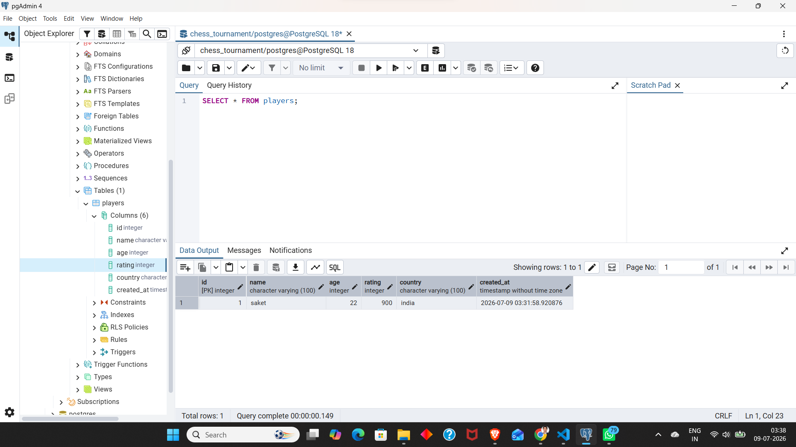
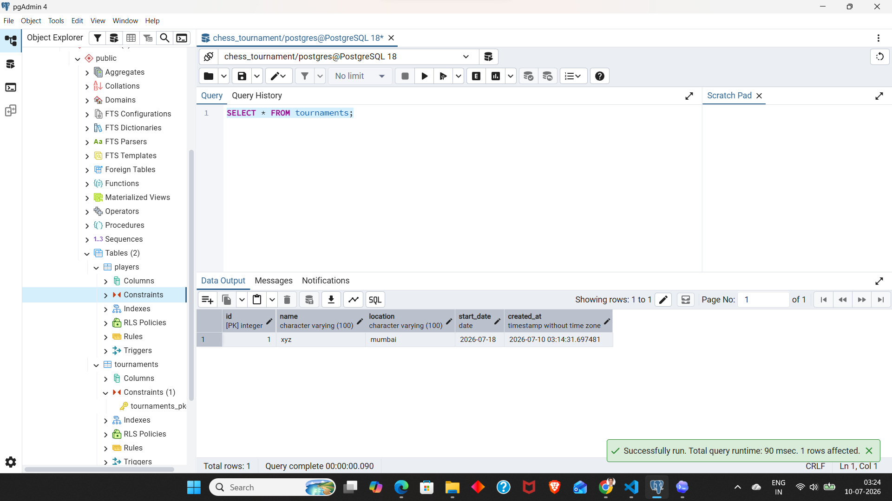

# ♟️ Chess Tournament Management System

A web-based Chess Tournament Management System built using **SvelteKit** and **PostgreSQL**.

The application allows administrators to manage players, create tournaments, assign players to tournaments, generate random matches, automatically select winners, and display tournament rankings.

---

# 🚀 Tech Stack

- **Frontend:** Svelte
- **Backend:** SvelteKit
- **Database:** PostgreSQL
- **Language:** JavaScript

---

# 📦 Project Setup

Clone the repository

```bash
git clone https://github.com/Saketbishnu/Chess_Tournament.git
```

Navigate to the project folder

```bash
cd Chess_Tournament
```

Install dependencies

```bash
npm install
```

Run the development server

```bash
npm run dev
```

Open

```
http://localhost:5173
```

---

# 🏗️ System Architecture

```
                User
                  │
                  ▼
          Svelte Frontend
                  │
         HTTP API Requests
                  │
                  ▼
        SvelteKit Backend
                  │
          PostgreSQL Queries
                  │
                  ▼
          PostgreSQL Database
```

---

# 🔄 Project Workflow

```
Admin Opens Website
        │
        ▼
Create Players
        │
        ▼
Create Tournament
        │
        ▼
Assign Players to Tournament
        │
        ▼
Generate Random Matches
        │
        ▼
Random Winner Selection
        │
        ▼
Store Match Results
        │
        ▼
Display Final Rankings
```

---

# 🗄️ Database Design

The project uses **four relational tables**.

```
Players
    │
    ▼
Tournaments
    │
    ▼
Tournament_Players
    │
    ▼
Matches
```

---

# 📋 Database Tables

## 1. Players

| id | name | age | rating | country |
|----|------|----:|-------:|---------|
| 1 | Saket | 22 | 900 | India |

### Table Structure

| Column | Data Type |
|----------|------------|
| id | SERIAL PRIMARY KEY |
| name | VARCHAR(100) |
| age | INTEGER |
| rating | INTEGER |
| country | VARCHAR(100) |
| created_at | TIMESTAMP |

### Screenshot



---

## 2. Tournaments

| id | name | location | start_date | created_at |
|----|------|----------|------------|------------|
| 1 | XYZ | Mumbai | 2026-07-18 | 2026-07-10 03:14:22 |

### Table Structure

| Column | Data Type |
|----------|------------|
| id | SERIAL PRIMARY KEY |
| name | VARCHAR(100) |
| location | VARCHAR(100) |
| start_date | DATE |
| created_at | TIMESTAMP |

### Screenshot



---

# ✨ Features

## ✅ Player Management

- Add Player
- View Players
- Update Player
- Delete Player

---

## ✅ Tournament Management

- Create Tournament
- View Tournaments
- Update Tournament
- Delete Tournament

---

## 🚧 Upcoming Features

- Add Players to Tournament
- Random Match Generation
- Random Winner Selection
- Match History
- Tournament Rankings (1st, 2nd, 3rd)
- Improved UI Design

---

# 📁 Project Structure

```
src
│
├── lib
│   └── server
│       └── db.js
│
└── routes
    ├── players
    │   ├── +page.svelte
    │   └── +server.js
    │
    ├── tournaments
    │   ├── +page.svelte
    │   └── +server.js
    │
    ├── matches
    │
    └── ranking
```

---

